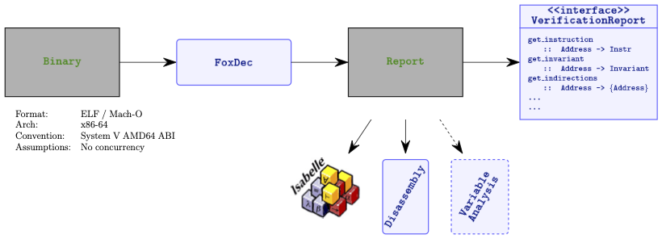

The FoxDec (for **Fo**rmal **x**86-64 **Dec**ompilation) project is investigating [decompilation][decompile] of x86-64 binaries into C code that is _sound_ as well as fully _recompilable_. Soundness ensures that the decompiled C code is functionally equivalent to the input binary. Recompilability ensures that the decompiled C code can be successfully compiled to generate an executable binary. 

FoxDec is currently actively being developed. In its current stage, it does disassembly, control flow reconstruction and function boundary detection.
Work-in-progress is variable analysis, decompilation to C, data flow analysis, and much more.

NEWS

* Our [decompilation-to-C paper][sefm20-paper] has received the Best Paper award at [SEFM 2020][sefm20]!
* Our [decompilation-to-C paper][sefm20-paper] has been accepted at [SEFM 2020][sefm20]!

## Table of Contents
1. [Introduction](#intro)
2. [How to build](#build)
3. [How to use](#usage)
4. [Documentation](#docs)
5. [Papers](#papers)
6. [Contact](#contact)

## Introduction 
**Formally verified decompilation.**
Decompilation to a high-level language involves multiple phases. At a high-level, the phases usually include disassembly that lifts assembly code from binary, control flow graph (CFG) recovery that extracts program CFG from assembly, extraction of high-level program constructs (e.g., statements, variables, references) from assembly, and type assignment. FoxDec is investigating techniques for the decompilation phases that are formally verified. 

FoxDec's decompilation phases include disassembly; CFG recovery; extraction of an abstract code that models a program as a CFG of basic blocks; converting basic blocks into sequential code that models the program's corresponding state changes over memory, registers, and flags; variable analysis that maps memory regions to variables and references; and type analysis that assigns types. Converting basic blocks into sequential code that captures program state changes requires a formal model of the underlying machine (i.e., formal semantics of x86-64 instructions). The project leverages the [Chum project][chum]'s formal x86-64 machine model for this purpose. 

Central to formally verified decompilation is the notion of _sound decompilation_. FoxDec defines soundness for each of these decompilation phases (sound disassembly is explored in a different project) and formally verifies them: algorithms for each phase are formalized in the [Isabelle/HOL theorem prover][isabelle] and proven correct. 

**Use cases.**
Sound, recompilable decompilation to C has a variety of use cases. For example, patching a binary to fix errors or potential security exploits is highly complex in settings where source code or third-party libraries are no longer available or build processes or tools have become outdated. Patching at the C-level is relatively easier and a compelling alternative when the decompiled C code is formally proven to be functionally equivalent to the binary. 

Other use cases include binary analysis, binary porting (as an alternative to [software emulation][qemu]), and binary optimization, each of which can now be performed at the C level (e.g., using off-the-shelf C code analysis and optimization tools). 

## How to build 
Download FoxDec [here](https://github.com/ssrg-vt/FoxDec/blob/7b72c66e903f6e6126b3a4f92ecf96576d2b9e65/foxdec/release/FoxDec.zip?raw=true). This will use [Docker](https://www.docker.com) to build and run FoxDec. The `README` file contains further instructions. The GitHub page is [here][git]. 

***NOTE:*** instructions for building without Docker can be found [here](foxdec/docs/build.md) *(only relevant for developpers)*.

## How to use 
These are instructions for a quickstart on ELF files. For more detailed information, see [here](#docs).

  

1. Move the binary of interest to `./binary/`. The binary `wc` has already been supplied as running example.
2. Run FoxDec on the binary `./foxdec.sh wc`
3. Directory `./artifacts/` is now populated with information.

The following files are generated:

- **`$NAME.json`** and **`$NAME.json.txt`**: Contain disassembled instructions, control flow recovery, function boundaries, invariants, pointer analysis results. The two files contain the exact same information, one in JSON format and the other in humanly readable format. The exact JSON taxonomy used to generate the JSON can be found [here][taxonomy].
- **`$NAME.metrics.json`** and **`$NAME.metrics.txt`**: a log containing metrics such as running time, number of covered instructions, accuracy of pointer analysis, etc. The two files contain the exact same information, one in JSON format and the other in humanly readable format.
- **`$NAME.calls.dot`**: A Graphviz `.dot` file containing the ACG (Annotated Call Graph), annotated with verification conditions necessary to ensure \"normal\" behavior (e.g., no stack overflows, calling convention adherence).
- **`$ENTRY/$NAME.dot`**: For each function entry **`$ENTRY`** a control flow graph (CFG).

	

## Documentation
For instructions on how to apply to MachO binaries and how to generate Isabelle/HOL code, we ask that you contact us. 
The user manual for FoxDec version 0.1 can be found [here](./foxdec/docs/manual/foxdec_manual.pdf).
Source code documentation can be found [here](https://ssrg-vt.github.io/FoxDec/foxdec/docs/haddock/index.html).

## Papers
* [Formally Verified Lifting of C-compiled x86-64 Binaries][pldi22-paper],
Freek Verbeek, Joshua A. Bockenek, Zhoulai Fu and Binoy Ravindran, 43rd ACM SIGPLAN Conference on Programming Language Design and Implementation (PLDI 2022), June 13-17, 2022, San Diego, USA.
* [_Sound C Code Decompilation for a Subset of x86-64 Binaries_][sefm20-paper],
Freek Verbeek, Pierre Olivier, and Binoy Ravindran, 18th International Conference on Software Engineering and Formal Methods (SEFM 2020), September 14-18, 2020, Amsterdam, The Netherlands.

## Contacts
* [Binoy Ravindran][binoy], Virginia Tech, <binoy@vt.edu>
* [Freek Verbeek][freek], Virginia Tech, <freek@vt.edu>

---

FoxDec is an open-source project from the Systems Software Research Group
([SSRG][ssrg]) at [Virginia Tech][vt]. It is supported by the Defense Advanced Research Projects Agency (DARPA) under contract N6600121C4028, and by the Office of Naval
Research ([ONR][onr]) under grant N00014-17-1-2297.

[1]: https://www.ssrg.ece.vt.edu/papers/memocode19.pdf
[2]: https://www.ssrg.ece.vt.edu/papers/cpp2019.pdf
[symbexec]: https://www.ssrg.ece.vt.edu/papers/spisa19.pdf
[3]: https://github.com/ssrg-vt/Chum-src/tree/master/cpp19_artifact
[memocode19]: https://memocode.github.io/2019/
[spisa19]: https://www.cl.cam.ac.uk/~jrh13/spisa19.html
[cpp19]: https://popl19.sigplan.org/track/CPP-2019
[cpp19artifact]: https://filebox.ece.vt.edu/~iroessle/cpp_2019.zip
[ssrg]: https://www.ssrg.ece.vt.edu/
[vt]: https://vt.edu/
[onr]: https://www.onr.navy.mil/
[navsea]: https://www.navsea.navy.mil/
[neec]: https://www.navsea.navy.mil/Home/Warfare-Centers/Partnerships/NEEC/
[freek]: http://www.cs.ru.nl/~freekver/
[binoy]: https://ece.vt.edu/people/profile/ravindran
[strata]: https://dl.acm.org/doi/10.1145/2980983.2908121
[isabelle]: https://isabelle.in.tum.de/
[sefm20]: https://event.cwi.nl/sefm2020/
[chum]: https://ssrg-vt.github.io/Chum/
[decompile]: https://en.wikipedia.org/wiki/Decompiler
[qemu]: https://www.qemu.org/
[sefm20-paper]: https://www.ssrg.ece.vt.edu/papers/sefm20.pdf
[sefm20-artifacts]: https://doi.org/10.5281/zenodo.3952034
[reportinterface]: https://ssrg-vt.github.io/FoxDec/foxdec/docs/haddock/VerificationReportInterface.html
[git]: https://github.com/ssrg-vt/FoxDec
[capstone]: https://github.com/aquynh/capstone/archive/4.0.1.zip
[taxonomy]: https://ssrg-vt.github.io/FoxDec/foxdec/docs/haddock/Data-JSON_Taxonomy.html
[pldi22-paper]: https://dl.acm.org/doi/10.1145/3519939.3523702
