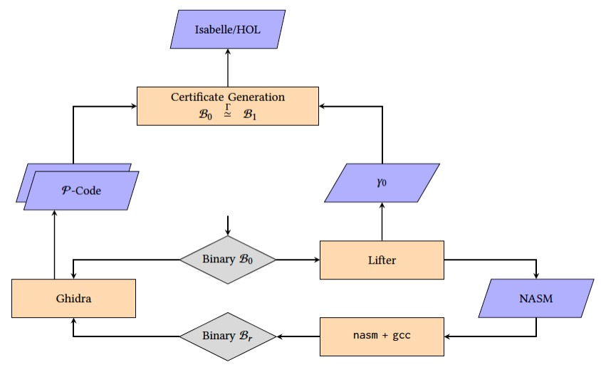

The FoxDec (for **Fo**rmal **x**86-64 **Dec**ompilation) project is investigating formally verified [decompilation][decompile] of x86-64 binaries that is _recompilable_, _patchable_, and _validatable_. A decompiler extracts higher-level code, such as an intermediate representation (IR), from a binary, and is a critical tool for enhancing software security when the source code is unavailable. Recompilability implies that the produced IR can be compiled back into a binary. Patchability refers to the ability to perform transformations. This typically requires _symbolization_: instruction addresses as well as the addresses of global variables, external functions, and data sections need to be replaced with labels. Validatability ensures that it is possible to check whether the produced IR is a _semantically sound_ representation of the original binary by applying formal (e.g., [theorem proving](https://en.wikipedia.org/wiki/Automated_theorem_proving)) and non-formal (e.g., [fuzzing](https://en.wikipedia.org/wiki/Fuzzing)) methods. 

The motivation behind decompilation with these three properties is multifold. First, it enables a decompile-patch-recompile workflow. Symbolization ensures that at recompile time, instructions and sections can be laid out by the recompiler, a prerequisite for making any modifications, such as inserting instructions or replacing functions. Second, it aids in the trustworthiness of the lifted IR. Recompilability enables the creation of an IR that is executable and can therefore be tested. We argue that even if an IR is formally proven to be a correct representation of the original binary, there is still significant value in testing. 

FoxDec is currently actively being developed. The latest version uses [Netwide Assembler (NASM)](https://www.nasm.us/) as the IR, while a [previous version][sefm20-paper] lifted C code. 

FoxDec enables multiple [use cases](#sec-use) for enhancing software security: i) formally verify memory safety properties, ii) enable trustworthy binary patching, and iii) enable trustworthy binary hardening. 

<b>NEWS</b>

* 01/19/25: Our [paper][icse25-paper] on binary-level pointer analysis has been accepted at [ICSE'25][icse25]!
* 08/29/24: Our [poster][ccs24-poster] on verified lifting to P-Code has been accepted at [CCS'24][ccs24].
* 07/05/24: Our [paper][ccs24-paper] on verified lifting and symbolization has been accepted at [CCS'24][ccs24]!
* 02/02/24: Our [paper][dimva24-paper] on exceptional interprocedural CFGs has been accepted at [DIMVA'24][dimva24]!
* 05/12/23: Our [paper][tap23-paper] on IRs for verified decompilation has been accepted at [TAP'23][tap23]!
* 09/05/22: Our [paper][vstte22-paper] on formal semantics for P-Code has been accepted at [VSTTE'22][vstte22]!
* 02/25/22: Our [paper][pldi22-paper] on verifying lifting and memory safety properties has been accepted at [PLDI'22][pldi22]!
* 09/17/20: Our [decompilation-to-C paper][sefm20-paper] received the **Best Paper award** at [SEFM 2020][sefm20]!
* 07/07/20: Our [decompilation-to-C paper][sefm20-paper] has been accepted at [SEFM 2020][sefm20]!

## Table of Contents
1. [Verifiably correct lifting](#lift)
2. [Decompilation to C](#decomp-to-C)
3. [Security use cases](#sec-use)
4. [Limitations](#limits)
5. [How to build](#build)
6. [How to use](#usage)
3. [How to recompile](#recompile)
5. [Papers](#papers)
6. [Contact](#contact)

## Verifiably correct lifting 

The following figure illustrates FoxDec’s design, which formally verifies the lifting of a binary executable  _B_0 to a machine-independent intermediate representation (MIIR). A key element of this design is that it enables a formal proof of correctness of the lifted MIIR. The formal verification approach is called [translation validation][pnueli98]. With this approach, a lifter is used to produce an MIIR from a binary. The MIIR is recompiled into a binary executable, _B_r. We now state that the lift is done trustworthily, if it can be proven that _B_0 and _B_r are semantically equivalent.  

The advantage of this approach is that it removes both the lifter and the compiler from the trusted code base. That means that we are free to implement both the lifter and the compiler in any way we like. As long as the two resulting binaries can be proven to be semantically equivalent, the MIIR is a correct higher-level representation of the original binary.

To prove that binary executables _B_0 and _B_r are semantically equivalent, we use one of the state-of-the-art binary lifters: [Ghidra](https://github.com/NationalSecurityAgency/ghidra). Ghidra converts both binaries, _B_0 and _B_r, to P-code, which operates at the same level of abstraction as assembly code. During lifting, we keep track of various observations (denoted as γ0) made over the original binary executable _B_0, which were used to generate the MIIR. The combination of the produced P-codes with the observations γ0 is used to build a certificate. That certificate contains a series of propositions, such that if all these propositions are true, then the two binaries are semantically equivalent. Note that this approach does not rely on Ghidra as a decompiler to produce source code but uses it solely as a disassembler.

To establish the proof, we utilize the [Isabelle/HOL theorem prover](https://isabelle.in.tum.de/). Isabelle/HOL takes propositions as input and attempts to prove that they are true by breaking down the proof into elementary reasoning steps that abide by the fundamental rules of mathematical logic. FoxDec generates the certificate in such a way that i) it is readable by Isabelle/HOL, and ii)  all its true propositions can be proven fully automatically.  A false proposition is unprovable and would indicate that something went wrong during lifting. A proven certificate completes the translation validation.

## Decompilation to C 

Decompilation to a high-level language involves multiple phases. At a high level, the phases typically include disassembly, which extracts assembly code from binaries; control flow graph (CFG) recovery, which recovers the program CFG from assembly; extraction of high-level program constructs (e.g., statements, variables, references) from assembly; and type assignment. FoxDec is investigating techniques for the formally verified decompilation phases. 

FoxDec's decompilation phases include disassembly, CFG recovery, extraction of an abstract code that models a program as a CFG of basic blocks; converting basic blocks into sequential code that models the program's corresponding state changes over memory, registers, and flags; variable analysis that maps memory regions to variables and references; and type analysis that assigns types. Converting basic blocks into sequential code that captures program state changes requires a formal model of the underlying machine (i.e., formal semantics of x86-64 instructions). 

Central to formally verified decompilation is the concept of _sound decompilation_. FoxDec defines soundness for each of these decompilation phases (sound disassembly is explored in a different project) and formally verifies them: algorithms for each phase are formalized in the [Isabelle/HOL theorem prover][isabelle] and proven correct. 

**Use cases.**
Sound, recompilable decompilation to C has a variety of use cases. For example, patching a binary to fix errors or potential security exploits is highly complex in settings where the source code or third-party libraries are no longer available, or the build processes or tools have become outdated. Patching at the C-level is relatively more straightforward and a compelling alternative when the decompiled C code is formally proven to be functionally equivalent to the binary. 

Other use cases include binary analysis, binary porting (as an alternative to [software emulation][qemu]), and binary optimization, each of which can now be performed at the C level (e.g., using off-the-shelf C code analysis and optimization tools). 

## Security use cases 

FoxDec enables enhancing software security in three different ways: i) verifying memory safety properties, ii) trustworthy binary patching, and iii) trustworthy binary hardening. 

FoxDec can verify a class of memory safety properties, including return address integrity, bounded control flow, and adherence to calling conventions. These properties are also established through formal proofs using the Isabelle/HOL theorem prover. FoxDec was demonstrated to verify these memory safety properties of [GNU CoreUtils][coreutils] and the [Xen hypervisor](https://xenproject.org/) (the industrial-strength virtualization software used in many production systems, including [Amazon AWS](https://aws.amazon.com/)). The case study conducted on Xen (which has 450K instructions) is the most extensive such memory safety verification conducted on an industrial-strength, off-the-shelf software system that was not written with formal verification in mind.

FoxDec can be used for trustworthy binary patching, such as replacing components of a binary with enhanced versions, which may be needed due to bug fixes, replacing deprecated code/library, or fixing vulnerabilities discovered in the original component. FoxDec’s trustworthy binary patching capabilities were demonstrated on the binary executable of the [World Wide Web Get (wget)](https://www.gnu.org/software/wget/) program, which is used in many systems to download files from the Internet, supporting the most widely used Internet protocols (e.g., HTTP and FTP). Currently, wget supports HTTP connections, despite them being considered insecure. FoxDec was used to patch wget so that it only supports HTTPS (the secure variant of HTTP). Additionally, FoxDec was demonstrated to replace the cryptography implementation that wget uses (i.e., [OpenSSL](https://www.openssl.org/)) with a new version that is quantum-resistant. Moreover, FoxDec was demonstrated for rapid remediation: the [CVE-2019-5953](https://nvd.nist.gov/vuln/detail/CVE-2019-5953) states that wget's function do_conversion() can cause a buffer overflow. For rapid remediation, FoxDec was used to patch wget so that it terminates whenever this security vulnerability occurs.

FoxDec can be used for trustworthy binary hardening. Example use-cases include: i) enhancing binary with [hardware-enabled control flow integrity][intel-cet], which prevents control flow hijack attacks, ii) enhancing binary with [read-only ELF][ro-elf] sections for relocations, which prevents arbitrary code execution attacks, and iii) generating debugging information for binary (after recompilation) to aid vulnerability analysis after a crash. 

## Limitations 

FoxDec’s current limitations include the following: 
* Binaries must be compiled from and adhere to the C standard (i.e., no C++).
* Binaries must be compiled for the x86-64 architecture (i.e., no ARM, or RISC-V).
* Only sequential code (i.e., no concurrency).

## How to build 
Download FoxDec [here](https://github.com/ssrg-vt/FoxDec/blob/0abd8c85cda0ccf3da9ef6683acb77a99c04b8b6/foxdec/release/FoxDec.zip?raw=true). This will use [Docker](https://www.docker.com) to build and run FoxDec. Section [How to use](#usage) contains further instructions. The GitHub page is [here][git]. 

***NOTE:*** instructions for building without Docker can be found [here](foxdec/docs/build.md) *(only relevant for developers)*.

## How to use 
These are instructions for a quickstart on the already supplied binary `wc`.

1. Move the binary of interest to `./binary/`. The binary `wc` has already been supplied as running example.
2. Run FoxDec on the binary `./foxdec.sh wc`
3. Directory `./artifacts/` is now populated with information.

The following files are generated:

- **`$NAME.json`** and **`$NAME.json.txt`**: Contain disassembled instructions, control flow recovery, function boundaries, invariants, pointer analysis results. The two files contain the exact same information, one in JSON format and the other in humanly readable format. 
- **`$NAME.metrics.txt`**: a log containing metrics such as running time, number of covered instructions, accuracy of pointer analysis, etc. The two files contain the exact same information, one in JSON format and the other in humanly readable format.
- **`$NAME.callgraph.dot`**: A Graphviz `.dot` file containing the ACG (Annotated Call Graph), annotated with verification conditions necessary to ensure \"normal\" behavior (e.g., no stack overflows, calling convention adherence).
- **`nasm/$NAME.asm`**: recompilable NASM code.
- **`functions/$ENTRY/$NAME.dot`**: For each function entry **`$ENTRY`** a control flow graph (CFG) and a log containing a pre- and a postcondition.

**NOTE:** it is possible to manually add entry points, by adding a plain-text file `./binary/$NAME.entry` where each line is an entry address in hexadecimal notation.

<!---
## Documentation
For instructions on how to apply to MachO binaries and how to generate Isabelle/HOL code, we ask that you contact us. 
The user manual for FoxDec version 0.4 can be found [here](./foxdec/docs/manual/foxdec_manual.pdf).
Source code documentation can be found [here](https://ssrg-vt.github.io/FoxDec/foxdec/docs/haddock/index.html).
-->

## How to recompile 

The following instructions recompile the generated NASM code back into a binary.

    nasm -felf64 -g -F dwarf -o $NAME.o $NAME.asm
    gcc -c __gmon_start__.c -o __gmon_start__.o
    gcc -g -m64 -nostartfiles -fgnu-tm -o a.out $NAME.o __gmon_start__.o

For the last compilation step, one must manually supply additional libraries as needed.

## Papers
* [_Formally Verified Binary-level Pointer Analysis_][icse25-paper],
  Freek Verbeek, Ali Shokri, Daniel Engel, and Binoy Ravindran, 47th IEEE/ACM International Conference on Software Engineering (ICSE 2025), April 27-May 3, 2025, Ottawa, Canada.
* [_Exceptional Interprocedural Control Flow Graphs for x86-64 Binaries_][dimva24-paper], Joshua Bockenek, Freek Verbeek, and Binoy Ravindran, 21st Conference on Detection of Intrusions and Malware & Vulnerability Assessment (DIMVA 2024), July 17-19, 2024, Lausanne, Switzerland.
* [_Verifiably Correct Lifting of Position-Independent x86-64 Binaries to Symbolized Assembly_][ccs24-paper], Freek Verbeek, Nico Naus, and Binoy Ravindran, 31st ACM Conference on Computer and Communications Security (CCS 2024), October 14-18, 2024, Salt Lake City, USA.
* [_CCS Poster: Formally Verified Binary Lifting to P-Code_][ccs24-poster], Nico Naus, Freek Verbeek, Sagar Atla, and Binoy Ravindran, Poster paper, 31st ACM Conference on Computer and Communications Security (CCS 2024), October 14-18, 2024, Salt Lake City, USA.
* [_BIRD: A Binary Intermediate Representation for Formally Verified Decompilation of x86-64 Binaries_][tap23-paper]. Daniel Engel, Freek Verbeek, and Binoy Ravindran, 17th International Conference on Tests and Proofs (TAP 2023), July 18-19, 2023, Leicester, United Kingdom.
* [_A Formal Semantics for P-Code. Nico Naus, Freek Verbeek, and Binoy Ravindran_][vstte22-paper], 14th International Conference on Verified Software: Theories, Tools, and Experiments (VSTTE 2022), October 17-18, 2022, Trento, Italy.
* [_Formally Verified Lifting of C-compiled x86-64 Binaries_][pldi22-paper],
Freek Verbeek, Joshua A. Bockenek, Zhoulai Fu, and Binoy Ravindran, 43rd ACM SIGPLAN Conference on Programming Language Design and Implementation (PLDI 2022), June 13-17, 2022, San Diego, USA.
* [_Sound C Code Decompilation for a Subset of x86-64 Binaries_][sefm20-paper],
Freek Verbeek, Pierre Olivier, and Binoy Ravindran, 18th International Conference on Software Engineering and Formal Methods (SEFM 2020), September 14-18, 2020, Amsterdam, The Netherlands.

## Contacts
* [Binoy Ravindran][binoy], Virginia Tech, <binoy@vt.edu>
* [Freek Verbeek][freek], Virginia Tech, <freek@vt.edu>

---

FoxDec is an open-source project from the Systems Software Research Group ([SSRG][ssrg]) at [Virginia Tech][vt].
It is supported by the Defense Advanced Research Projects Agency (DARPA) and Naval Information Warfare Center Pacific (NIWC Pacific) under Contract No. N66001-21-C-4028, DARPA under Agreement No. HR.00112090028, DARPA and the Army Contracting Command Aberdeen Proving Grounds (ACC-APG) under Prime Contract No. W912CG23C0024, DARPA under Prime Contract No. HR001124C0492, by the US Office of Naval Research (ONR) under grant N00014-17-1-2297, and by the US Naval Surface Warfare Center Dahlgren Division/Naval Engineering Education Consortium (NEEC) under grants N00174-20-1-0009 and N00174-16-C-0018.

[1]: https://www.ssrg.ece.vt.edu/papers/memocode19.pdf
[2]: https://www.ssrg.ece.vt.edu/papers/cpp2019.pdf
[symbexec]: https://www.ssrg.ece.vt.edu/papers/spisa19.pdf
[3]: https://github.com/ssrg-vt/Chum-src/tree/master/cpp19_artifact
[memocode19]: https://memocode.github.io/2019/
[spisa19]: https://www.cl.cam.ac.uk/~jrh13/spisa19.html
[cpp19]: https://popl19.sigplan.org/track/CPP-2019
[cpp19artifact]: https://filebox.ece.vt.edu/~iroessle/cpp_2019.zip
[ssrg]: https://www.ssrg.ece.vt.edu/
[vt]: https://vt.edu/
[onr]: https://www.onr.navy.mil/
[navsea]: https://www.navsea.navy.mil/
[neec]: https://www.navsea.navy.mil/Home/Warfare-Centers/Partnerships/NEEC/
[freek]: http://www.cs.ru.nl/~freekver/
[binoy]: https://ece.vt.edu/people/profile/ravindran
[strata]: https://dl.acm.org/doi/10.1145/2980983.2908121
[isabelle]: https://isabelle.in.tum.de/
[sefm20]: https://event.cwi.nl/sefm2020/
[chum]: https://ssrg-vt.github.io/Chum/
[decompile]: https://en.wikipedia.org/wiki/Decompiler
[qemu]: https://www.qemu.org/
[sefm20-paper]: https://www.ssrg.ece.vt.edu/papers/sefm20.pdf
[sefm20-artifacts]: https://doi.org/10.5281/zenodo.3952034
[reportinterface]: https://ssrg-vt.github.io/FoxDec/foxdec/docs/haddock/VerificationReportInterface.html
[git]: https://github.com/ssrg-vt/FoxDec
[capstone]: https://github.com/aquynh/capstone/archive/4.0.1.zip
[taxonomy]: https://ssrg-vt.github.io/FoxDec/foxdec/docs/haddock/Data-JSON_Taxonomy.html
[pldi22-paper]: https://dl.acm.org/doi/10.1145/3519939.3523702
[ccs24-paper]: https://dl.acm.org/doi/abs/10.1145/3658644.3690244
[pldi22]: https://pldi22.sigplan.org/
[ccs24]: https://www.sigsac.org/ccs/CCS2024/
[icse25]: https://conf.researchr.org/home/icse-2025
[icse25-paper]: https://www.computer.org/csdl/proceedings-article/icse/2025/056900a767/251mHBq8DZu
[intel-cet]: https://www.intel.com/content/www/us/en/developer/articles/technical/technical-look-control-flow-enforcement-technology.html
[ro-elf]: https://www.redhat.com/en/blog/hardening-elf-binaries-using-relocation-read-only-relro
[pnueli98]: https://doi.org/10.1007/BFb0054170
[coreutils]: https://www.gnu.org/software/coreutils/
[dimva24-paper]: https://ssrg.ece.vt.edu/papers/dimva24.pdf
[tap23-paper]: https://ssrg.ece.vt.edu/papers/tap23-bird.pdf
[vstte22-paper]: https://ssrg.ece.vt.edu/papers/vstte22.pdf
[ccs24-poster]: https://dl.acm.org/doi/abs/10.1145/3658644.3691386
[dimva24]: https://www.dimva.org/dimva2024/
[tap23]: https://conf.researchr.org/home/tap-2023
[vstte22]: https://vstte22.fbk.eu/

